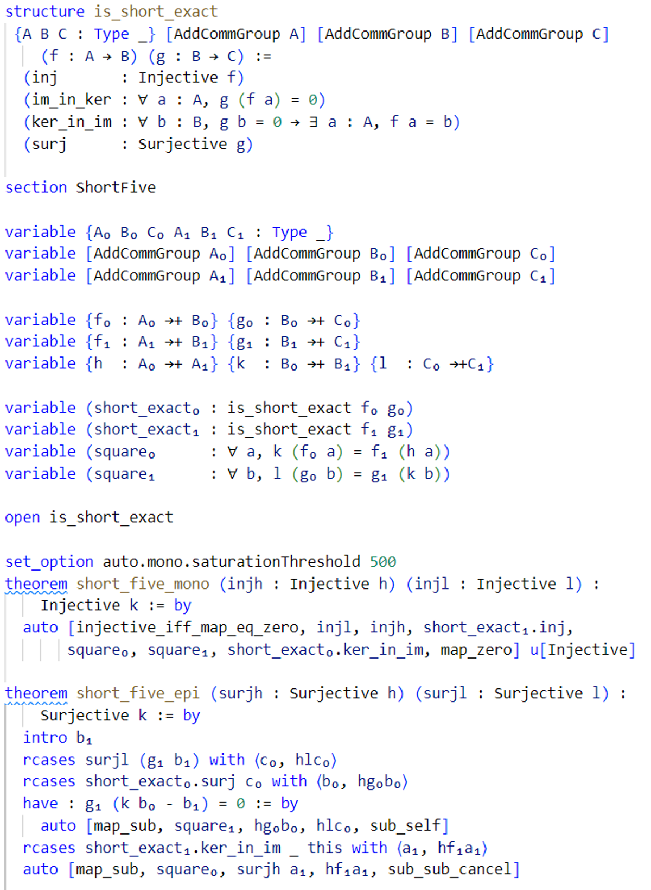

<p align="center">
  
</p>
  
[Lean-auto](https://arxiv.org/abs/2505.14929) is an interface between Lean and automated theorem provers. Up to now, lean-auto is maintained and developed primarily by Yicheng Qian (GitHub: PratherConid). It is currently in active development, and pull requests/issues are welcome. For more information, feel free to reach out to Yicheng Qian on [Lean Zulip](https://leanprover.zulipchat.com).  
  
Lean-auto is based on a monomorphization procedure from dependent type theory to higher-order logic and a deep embedding of higher-order logic into dependent type theory. It is capable of handling dependently-typed and/or universe-polymorphic input terms. Currently, proof reconstruction can be handled by [Duper](https://github.com/leanprover-community/duper), a higher-order superposition prover written in Lean. To enable Duper, please import the duper repo in your project, and set the following options:
```lean
import Auto.Tactic
import Duper.Tactic

open Lean Auto in
def Auto.duperRaw (lemmas : Array Lemma) (inhs : Array Lemma) : MetaM Expr := do
  let lemmas : Array (Expr × Expr × Array Name × Bool) ← lemmas.mapM
    (fun ⟨⟨proof, ty, _⟩, _⟩ => do return (ty, ← Meta.mkAppM ``eq_true #[proof], #[], true))
  Duper.runDuper lemmas.toList [] 0

attribute [rebind Auto.Native.solverFunc] Auto.duperRaw
set_option auto.native true
```
    
Although Lean-auto is still under development, it's already able to solve nontrivial problems. For example the first part of the "snake lemma" in category theory can be solved by a direct invocation to ``auto`` (and the second part can also be partly automated):

<p align="center">
  
</p>

Type **"auto 👍"** to test whether auto is set up.  

## Usage
* ``auto [<term>,*] u[<ident>,*] d[<ident>,*]``
  * ``u[<ident>,*]``: Unfold identifiers
  * ``d[<ident>,*]``: Add definitional equality related to identifiers
* The file ``Test/Test_Regression.lean`` in this repo contains working examples of usages of ``lean-auto``. Note that the ``native`` mode in ``Test/Test_Regression`` uses a dummy native solver, but this is only for testing. In real use cases, you should replace the dummy solver with a native theorem prover such as ``duper``. See below for detailed instructions.
* Currently, auto supports
  * SMT solver invocation: ``set_option auto.smt true``, but without proof reconstruction. Make sure that SMT solvers are installed, and that ``auto.smt.solver.name`` is correctly set. If you want to try 
  * TPTP solver invocation: ``set_option auto.tptp true``, but without proof reconstruction. Currently, we only support zipperposition. Make sure that ``auto.tptp.solver.name`` and ``auto.tptp.zeport.path`` are correctly set.
  * Proof search by native prover. To enable proof search by native prover, use ``set_option auto.native true``, and use ``attribute [rebind Auto.Native.solverFunc] <solve_interface>`` to bind `lean-auto` to the interface of the solver, which should be a Lean constant of type ``Array Lemma → Array Lemma → MetaM Expr``.

## Installing Lean-auto
* ``z3`` version >= 4.12.2. Lower versions may not be able to deal with smt-lib 2.6 string escape sequence.
* ``cvc5``
* ``zipperposition`` portfolio mode

## Utilities
* Command ```#getExprAndApply [ <term> | <ident> ]```: Defined in ```ExprExtra.lean```. This command first elaborates the ```<term>``` into a lean ```Expr```, then applies function ```<ident>``` to ```Expr```. The constant ```ident``` must be already declared and be of type ```Expr → TermElabM Unit```
* Command ```#genMonadState <term>, #genMonadContext <term>```: Defined in ```MonadUtils.lean```. Refer to the comment at the beginning of ```MonadUtils.lean```.
* Command ```#fromMetaTactic [<ident>]```: Calls ```Tactic.liftMetaTactic``` on ```<ident>```. The constant ```<ident>``` must be already declared and be of type ```MVarId → MetaM (List MVarId)```
* Lexical Analyzer Generator: ```Parser/LeanLex.lean```. The frontend is not yet implemented. The backend can be found in ```NDFA.lean```.

## Translation Workflow (Tentative)
* Collecting assumptions from local context and user-provided facts
  * We reduce ```let``` binders and unfold projections when we collect assumptions. So, in the following discussion, we'll assume that the expression contains no ```let``` binders and no ```proj```s.
  * We also $\beta$ reduce user provided facts so that there are nothing like $(\lambda x. t_1) \ t_2$
* $CIC \to COC$: Collecting constructors and recursors for inductive types (effectively, not directly)
  * e.g collecting equational theorem for *match* constructs
  * e.g collect constructors for inductively defined propositions
* $COC \to COC(\lambda^{c.u.})$: Monomorphization
  * Monomorphize all (dependently typed/universe polymorphic) facts to higher-order universe-monomorphic facts
  * $c.u.$ stands for "constant universe level"
  * Note that at this stage, all the facts we've obtained are still valid $CIC$ expressions and has convenient CIC proofs from the assumptions.
* $COC(\lambda^{c.u.}) \to COC(\lambda)$
  * We want all types $α$ occuring in the signature of constants and variables to be of sort ```Type (u + 1)```, i.e., $α : Type \ (u + 1)$. This is necessary because we want to write a checker (instead of directly reconstructing proof in DTT) and the valuation function from less expressive logic to dependent type theory requires [the elements in the range of the valuation function] to be [of the same sort].
  * To do this, we use ```GLift```. For example, ```Nat.add``` is transformed into ```Nat.addLift```
    ```lean
    structure GLift.{u, v} (α : Sort u) : Sort (max u (v + 1)) where
      /-- Lift a value into `GLift α` -/    up ::
      /-- Extract a value from `GLift α` -/ down : α

    def Nat.addLift.{u} (x y : GLift.{1, u} Nat) :=
      GLift.up (Nat.add (GLift.down x) (GLift.down y))
    ```
  * We only transfer these "lifted" terms to the less expressive $\lambda_2$, and $\lambda_2$ is unaware of the universe levels wrapped inside ```GLift.up```.
  * Lifted constantes should be introduced into the local context. Theorems corresponding to the original one but using only lifted constants and with uniform universe levels, should also be introduced into the local context. Later translations should only use theorems and constants with uniform universe levels.
* $\lambda \to \lambda(\text{TPTP TF0})$: Instantiating function arguments
  * $\lambda$ is the reified $COC(\lambda)$
* **There should also be a process similar to ULifting that "lifts" Bool into Prop, Nat to Int**

## Reification
* $COC(\lambda) \to \lambda(\text{TPTP\ TH0})$
  * ```Auto/Translation/LamReif.lean```
* $\lambda(\text{TPTP TF0}) \to \text{TPTP TF0}$
  * ```Auto/Translation/LamFOL2SMT.lean```

## Checker
* The checker is based on a deep embedding of simply-typed lambda calculus into dependent type theory.
* The checker is slow on large input. For example, it takes ```6s``` to typecheck the final example in ```BinderComplexity.lean```. However, this is probably acceptable for mathlib usages, because e.g ```Mathlib/Analysis/BoxIntegral/DivergenceTheorem.lean``` has two theorems that take ```4s``` to compile (but a large portion of the ```4s``` are spent on typeclass inference)

## Rules in Proof Tree
* `defeq <num> <name>`: The `<num>`-th definitional equality associated with definition `<name>`
* `hw <name>`: Lemmas hard-wired into Lean-auto
* `lctxInh`: Inhabitation fact from local context
* `lctxLem`: Lemma from local context
* `rec <indName>.<ctorName>`
* `rw [0, 1]`: Rewrite `0` using `1` (`1` must be an equality)
* `tyCanInh`: Inhabitation instance synthesized for canonicalized type
* `ciInstDefEq`: Definitional equality resulting from instance relations between ``ConstInst``s
* `termLikeDefEq`: Definitional equality resulting from definitional equalities between term-like subexpressions
* `❰<term>❱`: User-provided lemma `<term>`
* `queryNative::<func_name>`: Proved by native prover